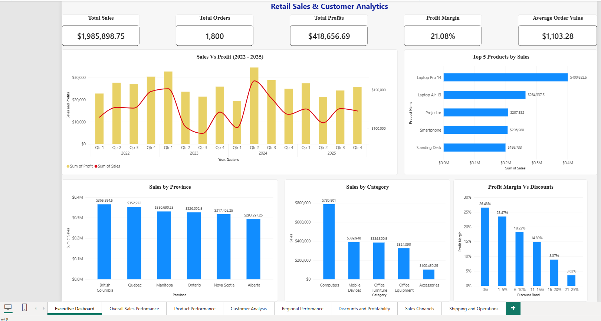
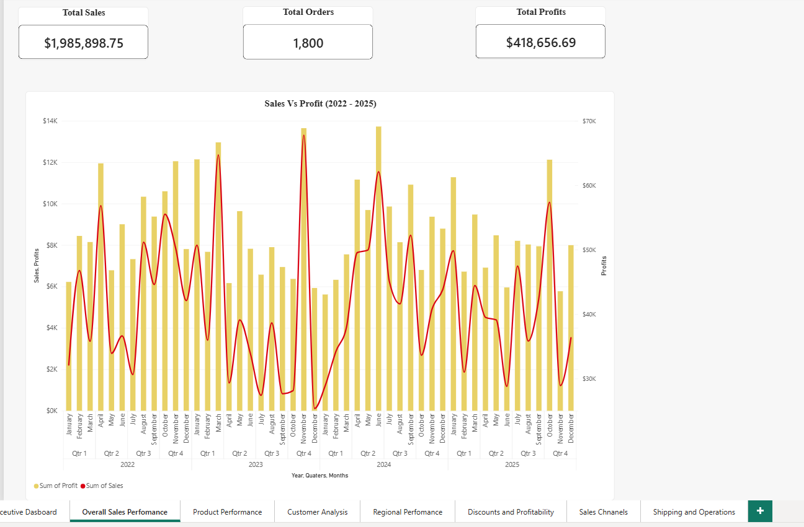
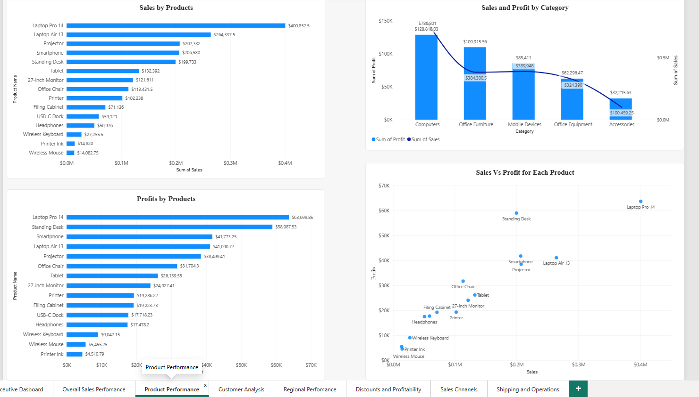
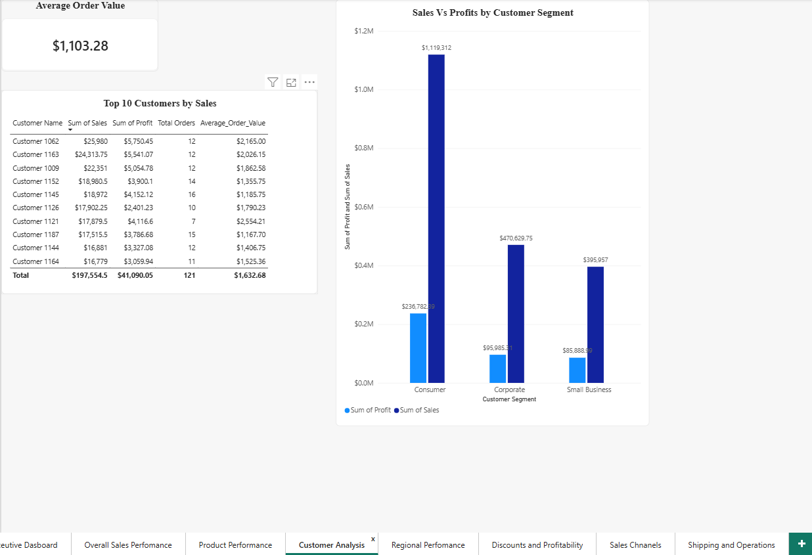
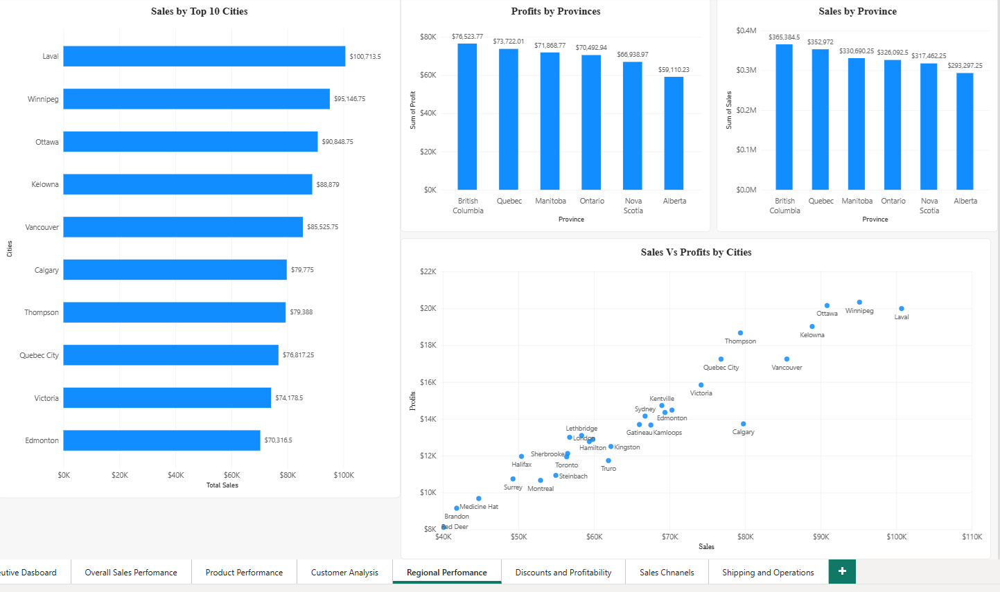
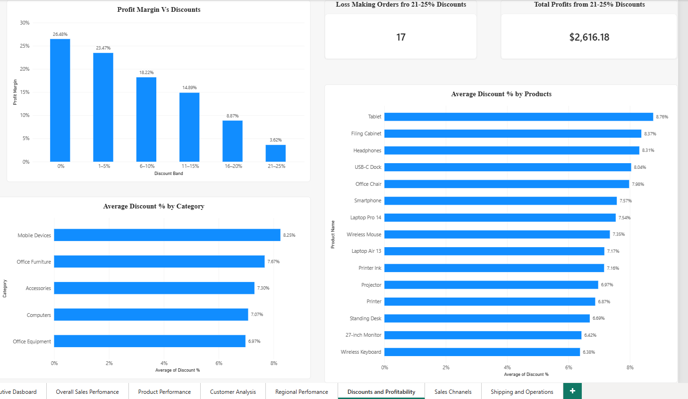
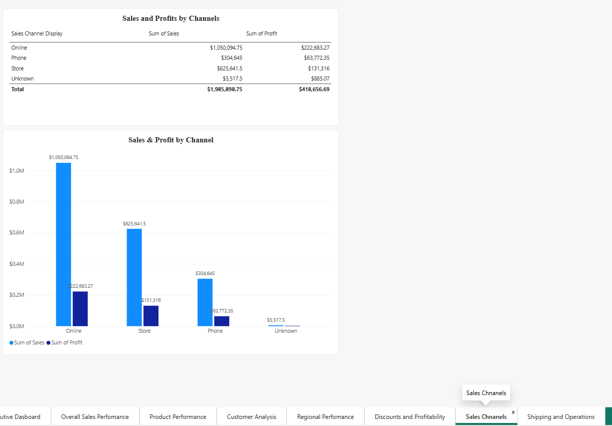
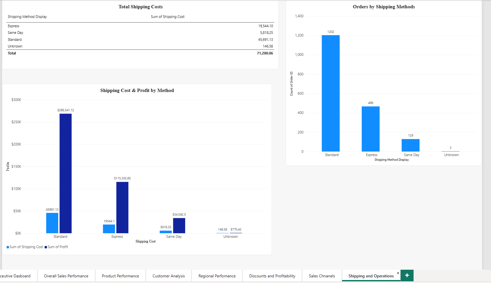

# Retail Sales & Customer Analytics

## Project Overview

This project uses Power BI to analyze retail sales performance, customer behavior, product performance, profitability, regional performance, discounts, sales channels, and shipping operations.

The goal was to transform transactional retail data into meaningful business insights that could support management decision-making.

## Workflow

The analysis followed a typical/ usual workflow:

**Define Business Questions → Prepare & Validate Data → Analyze Data → Build Visualizations → Identify Insights → Create Executive Dashboard**

## Dataset

The dataset contains:

- **1,800 sales transactions**
- **240 customers**
- **15 products**
- Sales data covering **2022–2025**
- Multiple Canadian provinces and cities
- Online, Store, and Phone sales channels

The dataset was created as a **synthetic dataset specifically for this portfolio project**. It is **NOT** official Canadian retail data.

## AI / Synthetic Data Disclosure

I prompted an AI tool to generate a synthetic retail dataset specifically for this portfolio project. The dataset was designed to provide realistic practice data for analyzing sales, customers, products, profitability, discounts, regional performance, and operations.

The data is synthetic and should not be interpreted as official or real-world Canadian retail statistics.

## Business Questions

The analysis focused on several key areas of retail business performance:

- Overall sales and profitability
- Product and category performance
- Customer and customer-segment performance
- Regional sales and profitability
- Discounts and their relationship with profitability
- Sales channel performance
- Shipping methods and operational costs

The detailed business questions and analysis findings are included in the accompanying project document.

## Tools Used

- **Excel** — Raw data storage and organization
- **Power Query** — Data cleaning and transformation
- **Power BI** — Data analysis, visualization, and dashboard development
- **DAX** — Measures and calculated columns

## Data Preparation

The data preparation process included:

- Reviewing column names and data types
- Checking for missing values
- Investigating missing values across multiple columns
- Checking the dataset grain
- Checking for duplicate transaction records
- Preserving missing values where appropriate rather than automatically treating them as zero
- Creating calculated fields and measures for analysis
- Preparing fields for business-focused visualizations

## Executive Dashboard

The Executive Dashboard was designed to provide management with a quick overview of the most important business metrics.

Key metrics include:

- Total Sales
- Total Orders
- Total Profit
- Profit Margin
- Average Order Value
- Sales and Profit Trends
- Sales by Category
- Sales by Province
- Top 5 Products by Sales
- Profit Margin vs. Discounts

The dashboard follows a simple management-focused flow:

**How much are we selling? → How profitable are we? → Where are sales coming from? → Which products are driving performance? → How do discounts relate to profitability?**

## Report Pages

### 1. Executive Dashboard

Provides a high-level overview of sales, profitability, products, categories, provinces, and discount performance.

### 2. Overall Sales Performance

Analyzes sales and profit trends over time and identifies monthly and quarterly performance patterns.

### 3. Product Performance

Analyzes product sales, product profitability, category performance, and the relationship between sales and profit.

### 4. Customer Analysis

Analyzes customer segments, top customers, average order value, and purchasing behavior over time.

### 5. Regional Performance

Analyzes sales and profitability across provinces and cities to identify strong-performing and potentially weaker regions.

### 6. Discounts & Profitability

Examines discount levels, profit margins, loss-making orders, and discount patterns across products and categories.

### 7. Sales Channels

Compares Online, Store, and Phone sales channels based on sales and profitability.

### 8. Shipping & Operations

Analyzes shipping method usage, shipping costs, and the relationship between shipping costs and profitability.

## Key Findings

- Total sales were **$1,985,898.75**, with **$418,656.69** in total profit.
- Overall profit margin was approximately **21.08%**.
- **Q4** generated the highest overall sales, with **November** being the strongest individual month.
- **Laptop Pro 14** generated the highest product sales and profit.
- **Computers** generated the highest category sales and total profit.
- **Consumer** customers generated the highest sales and profit among customer segments.
- **British Columbia** generated the highest provincial sales and profit.
- Higher discount levels were generally associated with lower profit margins.
- **Online** was the strongest sales channel by both sales and profit.
- **Standard shipping** was the most commonly used shipping method.
- Several high-sales products and regions showed comparatively lower profitability and could be investigated further by management.

## Business Value

This project demonstrates how a data analyst can transform transactional data into actionable business insights by:

- Measuring revenue and profitability
- Identifying high-performing products and customers
- Comparing regional performance
- Evaluating discount and margin relationships
- Comparing sales channels
- Analyzing operational costs
- Building an executive-level Power BI dashboard

## Skills Demonstrated

- Power BI
- Power Query
- DAX
- Data Cleaning
- Data Validation
- Data Analysis
- Business Intelligence
- Dashboard Design
- KPI Development
- Business Insight Generation

## Project Files

- `Retail_Sales_Customer_Analytics.pbix` — Power BI report
- `Retail_Sales_Customer_Analytics.xlsx` — Source dataset
- Business Questions and Analysis document — Detailed questions and findings
- Dashboard screenshots — Visual examples of the completed Power BI report

## Dashboard Screenshots

### Executive Dashboard

### Overall Sales Performance

### Product Performance

### Customer Analysis

### Regional Performance

### Discounts & Profitability

### Sales Channels

### Shipping & Operations

